# ZAPPY-EBANK

Introduction to Cloud Computing Security & Identity Management (IAM) 
Project Duration: 2 hours 
* This mini project is designed to guide you through the intricacies of Amazon Web Services (AWS), specifically focusing on Identity and Access Management (IAM). Before diving into the specifics of IAM, it's crucial to establish that a basic understanding of cloud computing principles is a prerequisite for this project. If you're hearing about "Cloud" for the first time, it would mean that you have not followed the program so far, so it is highly recommended that you go back to the start of this program to learn about the cloud. 
* As a recap, it involves delivering computing services over the internet, including servers, storagE databases, networking, software, analytics, and intelligence, to offer faster innovation, flexible resources, and economies of scale. 
*  In this project, we will be working with a hypothetical fintech startup named Zappy e-Bank. Thi fictitious company represents a typical startup venturing into the financial technology sector, to leverage the cloud's power to innovate, scale, and deliver financial services. The scenario is set up to provide a realistic backdrop that will help you understand the application of AWS IAM in managing cloud resources securely and efficiently. 

For Zappy e-Bank, like any company dealing with financial services, security and compliance are paramount. The company must ensure that its data, including sensitive customer information, is securely managed and that access to resources is tightly controlled. AWS IAM plays a critical role in achieving these security objectives by allowing the company to define who is authenticated (signed in) and authorized (has permissions) to use resources. 
IAM will enable Zappy e-Bank to: 
Create and manage AWS users and groups, to control access to AWS services and resources securely. 
Use IAM roles and policies to set more granular permissions for AWS services and external users or services that need to access Zappy e-Bank' AWS resources. 
Implement strong access controls, including multi-factor authentication (MFA), to enhance security. 
This project will walk you through setting up IAM for Zappy e-Bank, creating a secure environment that reflects real-world usage and challenges. Through this hands-on experience you will learn the fundamentals of IAM, how to manage access to AWS resources, and best practices for securing your cloud environment. 

> Project Goals and Learning Outcomes

By the end of this project, you will have: 
1. Gained a solid understanding of AWS IAM, including users, groups, roles, and policies. 
2. Learned how to apply IAM concepts to secure a fintech startup's cloud infrastructure. 
3. Developed practical skills in using the AWS Management Console to manage IAM. 
4. Understood the significance of secure access management and its impact on compliance and data security in the fintech industry. 
> Project Setup 
1. Log in to the AWS Management Console: Use your administrator account to log in. 
2. Navigate to the IAM Dashboard: Here, you'll manage users, groups, roles, and policies. 
Excercises: 
Creating IAM Users 

Excercises: 
Creating IAM Users 
An IAM user is a unique identity within an AWS account that represents a person or service, granting specific permissions to access and interact with AWS resources under controlled and customizable security policies. 
Imagine that you have a big, secure building (AWS account) that you own and control. When you first get the keys to this building, you're given a master key (root user) that can open every door, access every floor, and make changes to the building's structure itself. 
This master key is powerful, allowing you to do anything from adding new rooms (services) to changing the locks (security settings). However, because this key can do so much, it's also very risky to use it for daily tasks—like if you lost it, someone could do anything they want with your building. 
Now, imagine you have specific tasks that need to be done in the building, like cleaning, maintenance, or security checks. You wouldn't give out your master key to every person who needs to do those jobs. Instead, you create specific keys (IAM users) that can only open certair doors or access certain floors. These keys are less powerful but much safer to use for everyday tasks. They ensure that the people holding them can only access the parts of the building they need to do their jobs and nothing more. 

Let's set up IAM users for a backend developer, John, and a data analyst, Mary, by first determining their specific access needs. 
As a backend developer, John requires access to servers (EC2) to run his code, necessitating ar IAM user with policies granting EC2 access. I 
As a data analyst, Mary needs access to data storage (AWS S3 service), so her IAM user shoulc have policies enabling S3 access. 
Considering Zappy e-Bank's plan to expand its team with 10 more developers and 5 additiona data analysts in the coming months, it's inefficient to individually create similar policies for each new member. A more streamlined approach involves: 
1. Crafting a single policy tailored to each role's access requirements. 
2. Associating this policy with a group specifically designed for that role. 
3. Adding all engineers or analysts to their respective groups, simplifying the management at permissions and ensuring consistent access across the team. 
Create policy for the Development team 

THEREFORE:

1. In the IAM console, click on policies 

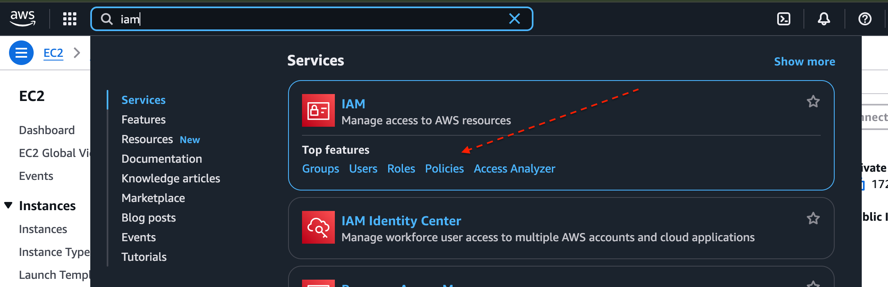
 2. click create policy 

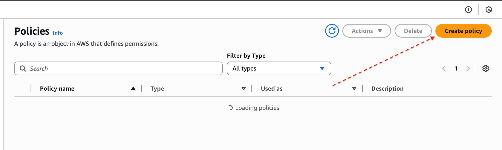

3. In the "select service section" search Ec2

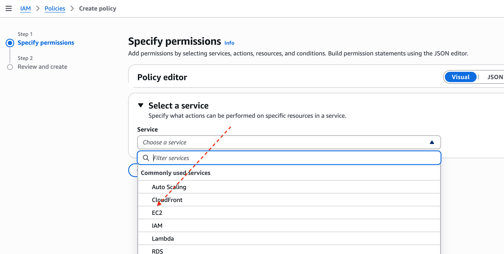

4. for simplicity sake select the " all Ec2 actions " checkbox

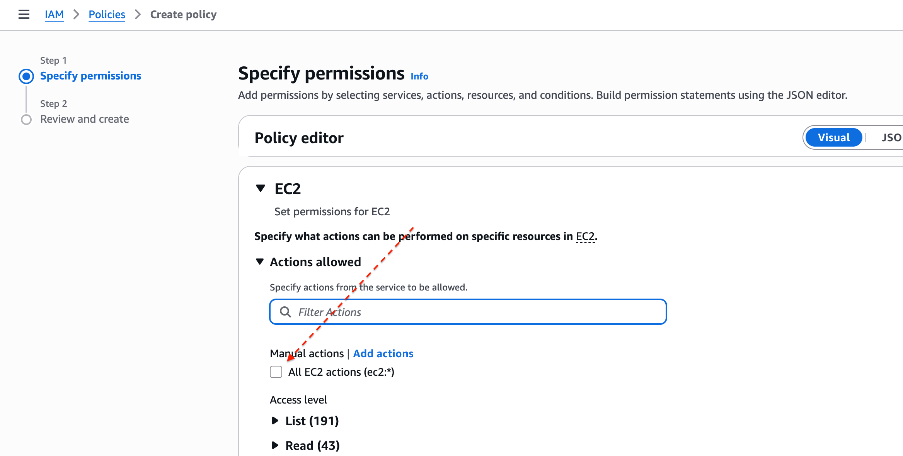

5. Also make sure you select "ALL" in the resources section 

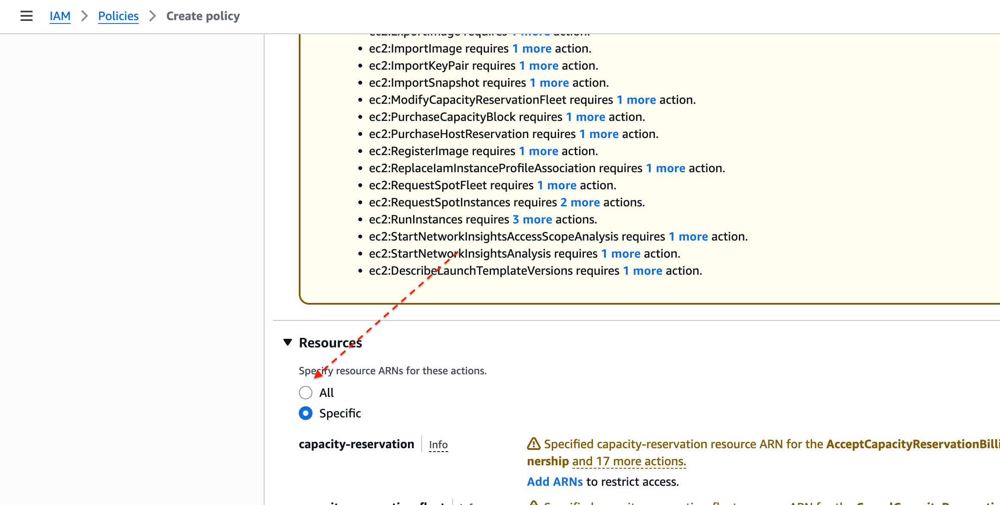

6. click next 
7. provide the name "developer" and the description for the policy 
8. Then you create the policy 

Let's set up IAM users for a backend developer, John, and a data analyst, Mary, by first determining their specific access needs. 
As a backend developer, John requires access to servers (EC2) to run his code, necessitating ar IAM user with policies granting EC2 access. I 
As a data analyst, Mary needs access to data storage (AWS S3 service), so her IAM user shoulc have policies enabling S3 access. 
Considering Zappy e-Bank's plan to expand its team with 10 more developers and 5 additiona data analysts in the coming months, it's inefficient to individually create similar policies for each new member. A more streamlined approach involves: 
1. Crafting a single policy tailored to each role's access requirements. 
2. Associating this policy with a group specifically designed for that role. 
3. Adding all engineers or analysts to their respective groups, simplifying the management at permissions and ensuring consistent access across the team. 
Create policy for the Development team 
1. In the IAM console, click on policies 

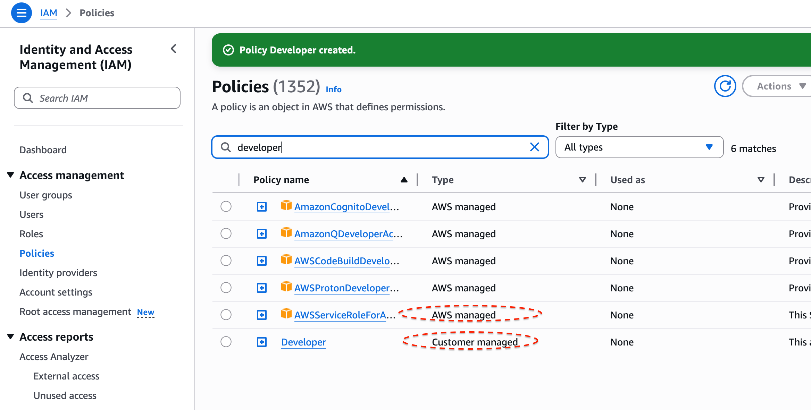

THEN we do the same process for data analyst team 
 

> CREATE GROUP FOR THE DEVELOPMENT TEAM 

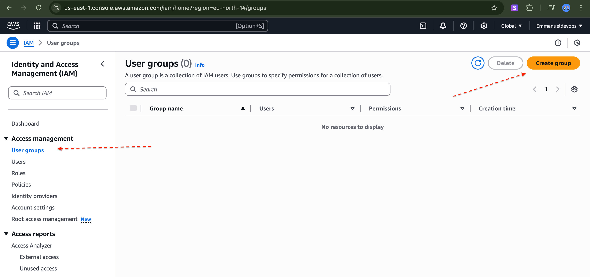

2. provide a name of the group 

Attach the developer policy we created earlier to the group. this will allow any user in the DEVELOPMEMT-TEAM group to habve access to ec2 instance only 

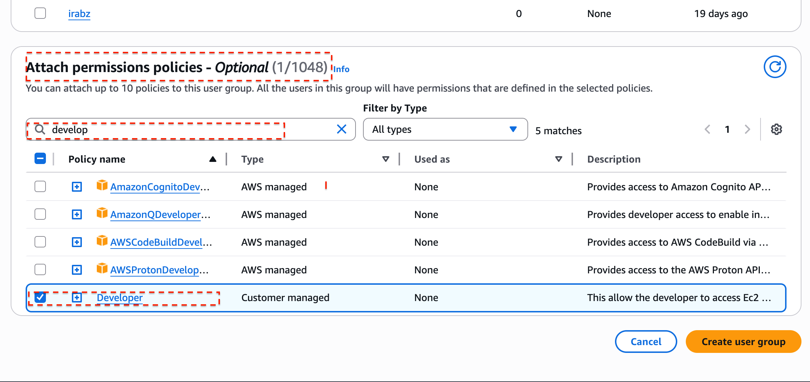
 4. You have successfully created a group and attached a permission policy for any user added to the group to have acces to ec2 instance only 

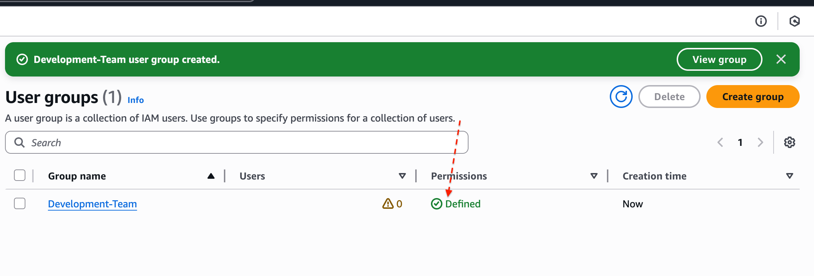

Create Group for the Data Analysts team Repeat the process above for the Data Analysts team. The Group name should be Analyst-Team ii. Instead of attaching developers policy, attach analyst policy. Recall that you only allowed S3 access for this policy. So any user in this group will have access to S3 Service. In our case, our users will be the data analysts. 

1. provide a name of the group 

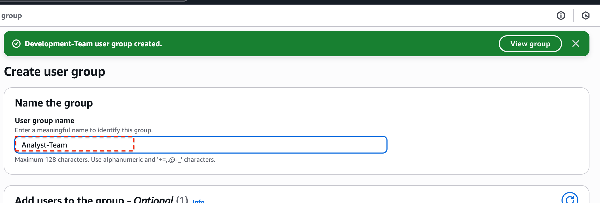

2. Attach the analyst policy we created earlier to the group. this will allow any user in the ANALYST-TEAM group to habve access to s3

 3. You have successfully created a group and attached a permission policy for any user added to the group to have acces to s3

 

Creating 1AM User for John 
Let's recall that John is a backend developer, therefore he need to be added as a user to the I Development-Team group 
Navigate to the IAM dashboard, select "Users" and then click "Create user". 

* provide the name of the user in the case "john"

* ensure that the user can access the AWS MANAGENENT console. if this is not selected, the user will not be able to login on web

* permission: ADD the john to the development team  group 

* Then create 

* Yet again we do the same for mary (data analyst)

* provide the name of the user in the case "mary"

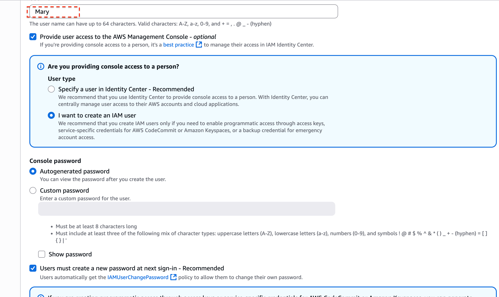

* ensure that the user can access the AWS MANAGENENT console. if this is not selected, the user will not be able to login on web

* permission: ADD the john to the analyst team  group 

